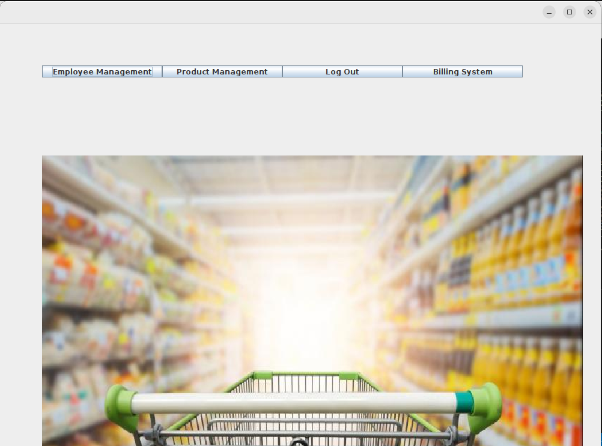
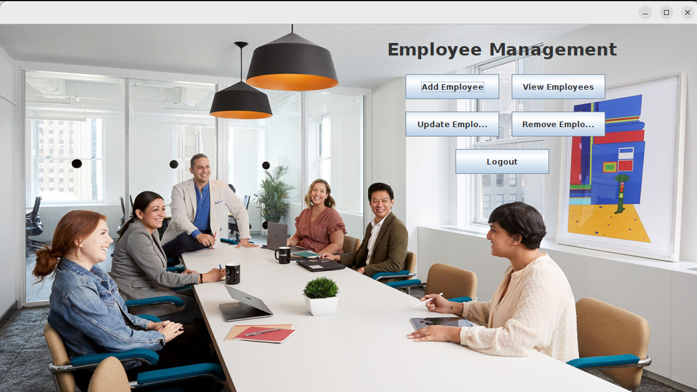
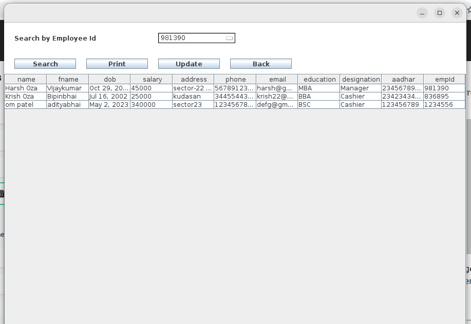
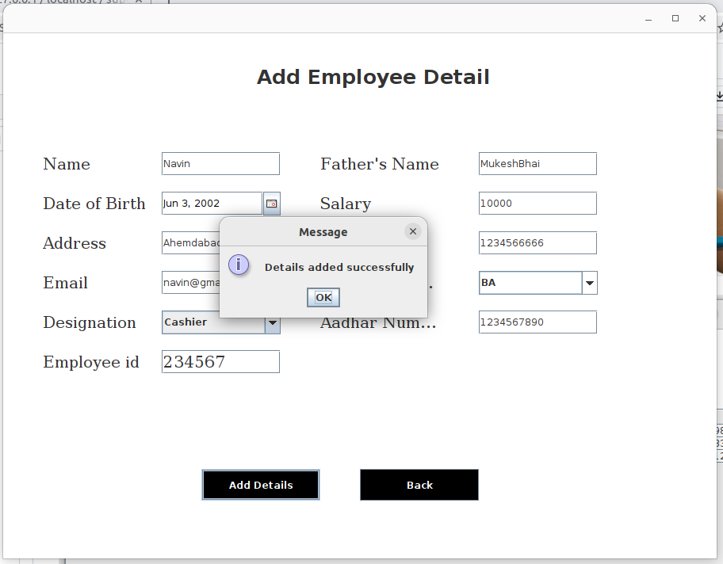
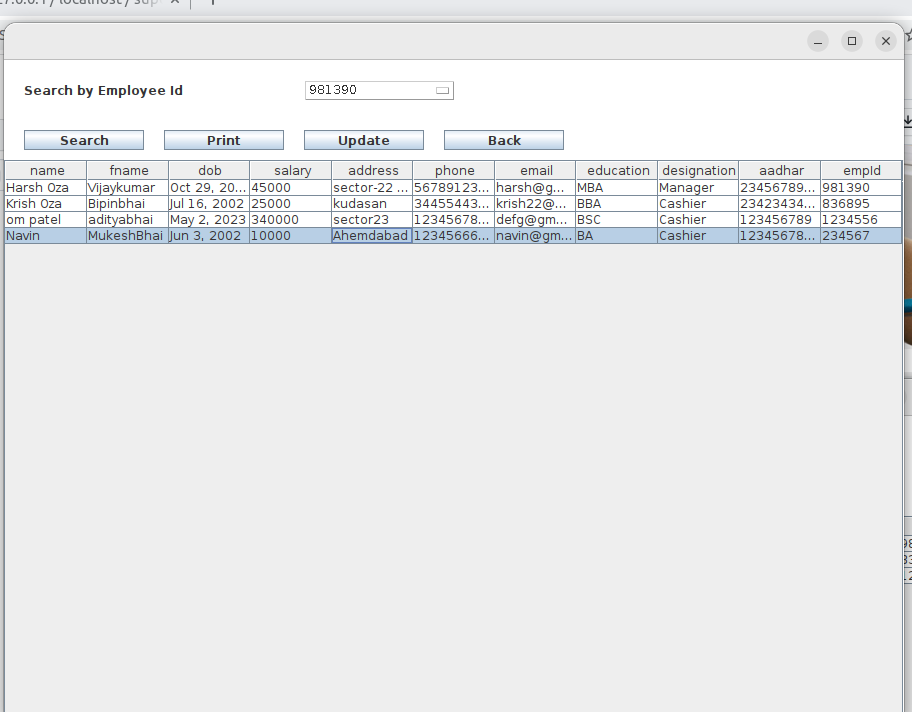
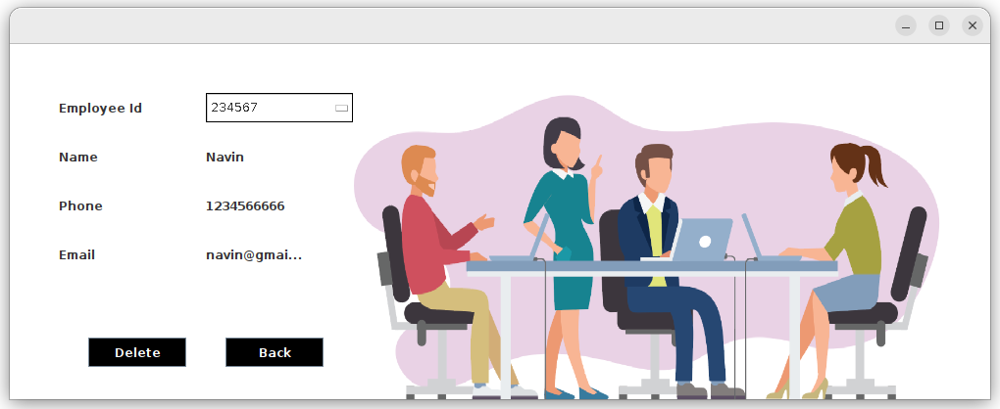
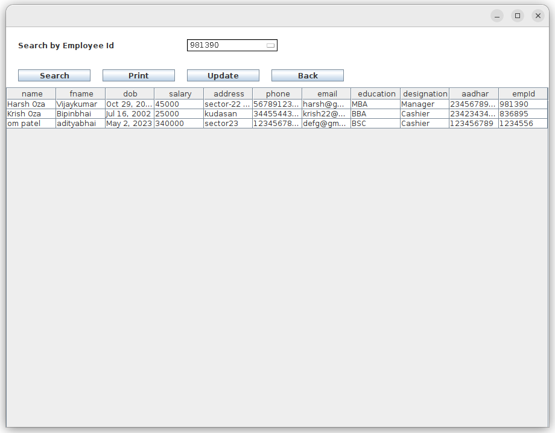
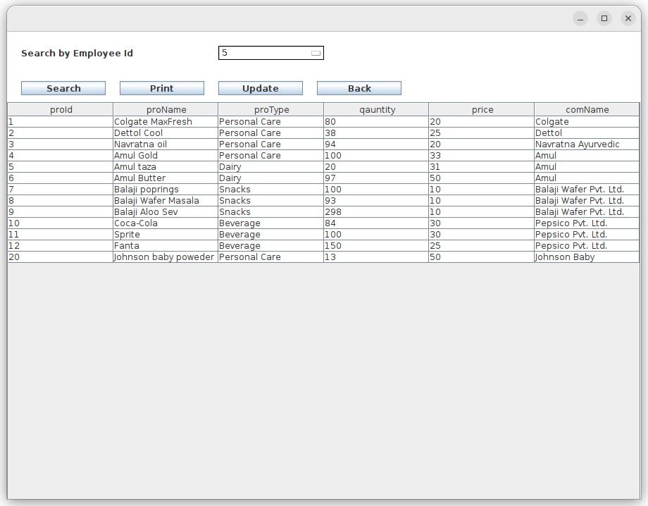

# Super Market Management System

## DATABASE CONECTIVITY :

In Mysql DBMS, 
- create database named as "supermarketmanagementsystem".
+ create tables named as "login" ,"employee" and "product".

Structure of "login" table

Structure of "employee" table

Structure of "product" table

## How to run an application

+ make database connectivity
+ add external jar files to project directory
+ run the file "src/Splash.java"
## Working of Application

+ run src/Splash.java

+ Signup module for new employee
+ Here are 3 types of users(Admin,Manager,Cashier)
+ Input validation :
    + Password and Confirm-Password should be same
    + Username and Password have to be more 0 length and less than size of VARCHAR specified in DB.
    + Password must contain atleast one Uppercase [A-Z] ,Lowercase [a-z], Number [0-9] and Special Char(@#$%) 

+ Added detailes for one employee

+ DETAILS also added successfully to "login" table

+ login as "Navin"
+ Since "Navin" is cashier, he is able to see only options for logout and billing System

+ after enter detailes of cutomer we can add items by thier Id or Name using add1 button or add2 button 

+ after pessing bill you will bill in your textarea

+ save as will create txt file for bill and refresh button reset input fields

+ when you logged in as "admin" you will get additionally two more functionality for employee management and product management

+ employee detailes after pressing view employee

+ adding new employee detailes

+ after adding new employee 

+deleting employee by employeeId 

+after deleting an employee

+ same CRUD functionalities for product management

+ product detailes

